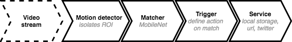
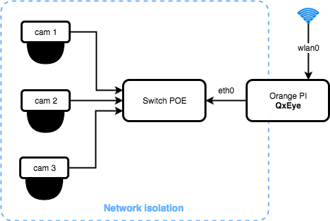

# QxEye

QxEye is a KISS-coded project to ensure that the threat is there before reporting the incident.
It is not and there is no remote access system. **QxEye is a stand-alone vision system**.

It is designed to run on tiny hardware like RaspberryPI or OrangePI, but requires at least an ARMv7 to take advantage of hardware optimizations.


## How It Works




QxEye reads the camera's video stream. It will compare the image with a stack of previous images to isolate the movement zones and then analyze each zones with a pre-trained dnn to detect objects with precision, such as a person.

Finally, you will have the choice to save a capture, tweet direct message, call an url or execute a script when a match is positive.


### My installation
To inspire you here is the installation that I set up at home :



With the POE, Orange PI and camera are powered by switch! So, there is only one power outlet plugged in!!

An another advantage to this setup, is that cameras are isolated on sub network.
This configuration prohibits any hacking of camera streams and also prohibits cheap cameras containing dubious firmware from accessing the internet or my local network.


## Configuration

Configuration is splitted in 4 sections :
- `cameras` : list of cameras streams
- `matchers`: list of matchers used to provide detection
- `triggers`: list of triggers 
- `services`: list of services configuration

### Cameras

`cameras` section is an array of object like this

```js
 "cameras": [
    {
      "name": String, // Name of camera
      "enabled": Boolean, // Camera enabled or not
      "endpoint": String, // Endpoint of camera
      "persistence": Int, // Image persistence, see below
      "matcher": String, // Matcher name 
      "zones": [ // Array of zone
        {
          "ignore": Bool, // Optional, indicate if zone is opaque or confidential
          "color": String, // Color (RRGGBB) of non ignored zone
          "mask": [ 
            // Mask definition, see below
          ]
        }
      ]
    }
  ]
```

#### Image Persistence
Image persitence is used to isolate motion in image.

When a new image is read, it merges with the previous images with a transparency factor to create a new image representing the average of movements such as wind in trees or grass...

`persistence` is the thousandth of an opacity applied to the image before merging into the stack.

Therefore, higher is the value, more sensitivity will increase but may cause CPU overload.

#### Zones
Zones have 2 utilities, firstly ignore sensitive or uninteresting places, such as the neighbor's garden. Secondly, define zones in which detections can have a different meaning.

`mask` is an array of string, each row represent horizontal slice on image, each character, represent au vertical slice of row.

A blank " " char represent a empty space, and char "#" represent a mask

This mask below represent a mask than slice image in 2 row of 2 columns and hide the first quarter
```js
[
    "# ",
    "  "
]
```

But each column is relative to its line, so you can write that to do the same thing.
```js
[
    "# ",
    ""
]
```

For example, more complicated :
```js
[
    "## ##",
    ""
    ""
    " #"
]
```
Image will be sliced into 4 lines, first line will be slices in 5 cols and last in 2 col

### Matchers

`matchers` is an array of object like this:

```js
"matchers" : [
    {
      "name": String, // Name of matcher
      "type": String, // Type of matcher, set to "dnn"
      "params": { 
        // Object of params
      }
    }
]
```

### Triggers

`triggers` is an array of object like this:

```js
"triggers": [
    {
      "on": String,
      "zones": [ String ], // Optionnal
      "confidence": Float, // confidence level 
      "service": String, // Service used
      "delay": Int, // Time delay in seconds during which the trigger is deactivated after being called
      "params": {
          // Object of trigger params
      }
    }
]
```

### Services

`services` is an object of object like this:

```js
"services": [
   "myServiceName": { 
       "service": String // file, http or twitter
       "params": {
            // Params
       }
   }
]
```
#### file
Capture image and save it to a file

```js
{
    "dir": "./captures", // Dir to store file
    "traces": "matches,ignoredZonesOnly" // Comma separated trace flag
}
```
**traces** add some traces to the capture  and can take value:
* `matches` print rect of item matches
* `ignoredZonesOnly` draw an black rect on the ignored zones
* `zones` print zones


#### twitter
```js
{
    "consumerKey": "xxxxxxxxxxxxxxxxxxxxxxxx",
    "consumerSecret": "xxxxxxxxxxxxxxxxxxxxxxxx",
    "accessToken": "xxxxxxxxxxxxxxxxxxxxxxxx",
    "accessTokenSecret": "xxxxxxxxxxxxxxxxxxxxxxxx"
}
```

#### http

```js
{
    "url": "http://", // Dir to store file
    "traces": "matches,ignoredZonesOnly" // Comma separated trace flag
}
````

#### script
Not implemented yet

---

# Install

**Requirements**

* Go 1.9 (but 1.8 should work)
* OpenCV 3.3

## Opencv 3.3 Install

Inspired by https://www.pyimagesearch.com/2017/10/09/optimizing-opencv-on-the-raspberry-pi/

Prepare deps

```sh
sudo apt update
sudo apt upgrade
sudo apt remove x264 libx264-dev
sudo apt install build-essential checkinstall cmake pkg-config yasm gfortran git libjpeg8-dev  libpng16-16 libtiff5-dev libavcodec-dev libavformat-dev libswscale-dev libdc1394-22-dev libxine2-dev libv4l-dev libgstreamer1.0-dev libgstreamer-plugins-base1.0-dev libqt4-dev libgtk2.0-dev libtbb-dev libatlas-base-dev libfaac-dev libmp3lame-dev libtheora-dev libvorbis-dev libxvidcore-dev libopencore-amrnb-dev libopencore-amrwb-dev x264 v4l-utils libgoogle-glog-dev libgflags-dev libgphoto2-dev libeigen3-dev libhdf5-dev
```

Get opencv 3.3
```sh
wget -O opencv.zip https://github.com/Itseez/opencv/archive/3.3.0.zip
unzip opencv.zip
wget -O opencv_contrib.zip https://github.com/Itseez/opencv_contrib/archive/3.3.0.zip
unzip opencv_contrib.zip
```

Compile
```sh
cd opencv-3.3.0/
mkdir build
cd build
cmake -D CMAKE_BUILD_TYPE=RELEASE \
    -D CMAKE_INSTALL_PREFIX=/usr/local \
    -D OPENCV_EXTRA_MODULES_PATH=../../opencv_contrib-3.3.0/modules \
    -D ENABLE_NEON=ON \
    -D ENABLE_VFPV3=ON \
    -D WITH_TBB=ON \
    -D BUILD_TESTS=OFF \
    -D INSTALL_PYTHON_EXAMPLES=OFF \
    -D BUILD_EXAMPLES=OFF ..
```

## Install qxeye

`go get github.com/qwantix/qxeye`


---


# Roadmap & Notes

* Implement ftp and script trigger
* Implement/test [movidus](https://developer.movidius.com/) support
* Support YOLO2 model
* Support simple classifier
* Support haarcascade ? useful?
* Record a video sample instead of capture
* Pretrain model optimized for video surveillance
* Auto adjust trained model
* Face detection ?
* Detect dangerous, hesitant or suspicious trajectories


